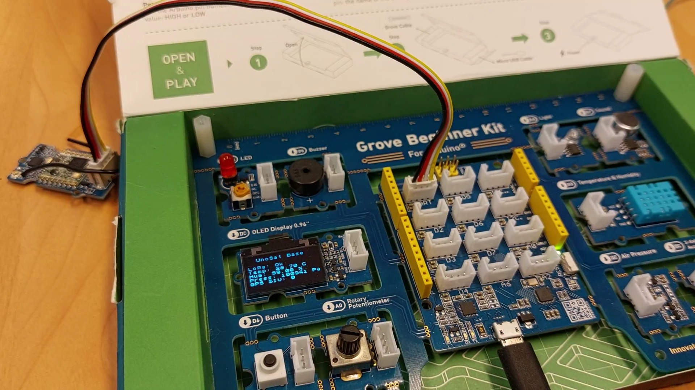

# Grove Beginner Kit for Arduino wireless example

This example will demonstrate how to use the UnoSat platform with two Grove Beginner Kit for Arduino
and two [Grove LoRa Radio wireless 868Mhz v1.0](https://wiki.seeedstudio.com/Grove_LoRa_Radio)
communication modules to collect data on one of the Grove kits and send it to
and display it on the second Grove Kit.

The first Grove kit will collect temperature, humidity and pressure data.
It will send the data using the LoRa module to the second kit and also display it on its LCD screen.
The second Grove kit will not use any of its own sensors.
Instead, it will just wait for incoming messages via the LoRa module
and then display the contents on its LCD screen.

The code for the main Grove Kit with all the sensors is in [this directory](.),
the code for the second receiving Grove Kit is in the [`Receiver` directory](Receiver).

## Requirements
### Hardware

* 2x Grove Beginner Kit for Arduino
* 2x Grove LoRa Radio wireless 868Mhz v1.0 modules

### Software
This project uses the [ECom](https://gitlab.com/team-aster/software/ecom) library
to define how to communicate with the Arduino and for generating some code for it.
The library must be installed if any changes to the communication are necessary.

Because the code in this project is spread out over multiple files,
the Arduino IDE can not be used to compile and upload the project onto the Arduino.
Instead, this project uses [PlatformIO](https://docs.platformio.org),
which can be downloaded [here](https://docs.platformio.org/en/latest/core/installation/index.html).

After the installation, run the following command in the [root directory of the project](.)
(where this README is located) to finish initialization of the project:

```shell
pio project init
```

## Hardware setup
Connect the LoRa modules to the UART1 port of the Grove Kit.



Note: The UART1 connection to the LoRa module has to be temporarily removed every time
when flashing the software onto the kit, otherwise the flash operation will not succeed.

## Building and Flashing

Connect the first Kit to the computer, this will be the one generating and sending the data.
Temporarily remove the UART1 connection to the LoRa module on the kit
and execute the following command in the [current directory](.):
```shell
pio run --target upload
```

This will upload the code onto the Kit.
If multiple devices are connected to the computer, it might be necessary to specify
which serial port to upload to via the `--upload-port` argument.

Next, connect the second Kit to the computer, this will be the one receiving and displaying the data.
Follow [the receivers build and flash instructions](Receiver/README.md#building-and-flashing).

### Updating the communication definition

When changing the communication database in the [`communication` folder](communication),
the following command has to be executed in the [current directory](.) to update the generated code:
```shell
ecomUpdate --database communication src include
```
