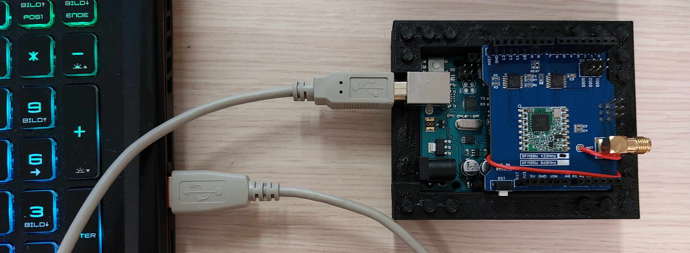

# UnoSat LoRa Shield - Proxy example

This is part of the UnoSat LoRa Shield example and demonstrate a very simple proxy
that sits between the groundstation and the base Arduino.
The groundstation is most likely is running on a device that doesn't have direct access
to a 433 MHz LoRa wireless module. This proxy, an Arduino Uno with a
[LoRa 433 Mhz Radio Shield](https://www.makerfabs.com/lora-radio-shield-433mhz.html), allows the
groundstation to receive the messages send with LoRa via their USB port.



## Requirements
### Hardware

* Arduino Uno
* LoRa 433 Mhz Radio Shield

### Software
The [simple groundstation](https://gitlab.com/team-aster/software/ecom/-/tree/main/examples/simpleGroundstation)
from the [ECom](https://gitlab.com/team-aster/software/ecom) library can be used to read the telemetry from the Arduino.

Because the code in this project is spread out over multiple files,
the Arduino IDE can not be used to compile and upload the project onto the Arduino.
Instead, this project uses [PlatformIO](https://docs.platformio.org),
which can be downloaded [here](https://docs.platformio.org/en/latest/core/installation/index.html).

After the installation, run the following command in the [root directory of the project](.)
(where this README is located) to finish initialization of the project:

```shell
pio project init
```

## Building and Flashing

To build the project and upload it to an Arduino Uno, connect the Arduino to the computer.
If some hardware is connected to the UART1 port of the Arduino, temporarily unplug it,
otherwise the upload will fail because the UART1 and USB connection share the same port.
Finally, execute the following command in the [root directory of the project](.):

```shell
pio run --target upload
```

This will upload the code onto the Arduino.
If multiple devices are connected to the computer, it might be necessary to specify
which serial port to upload to via the `--upload-port` argument.
