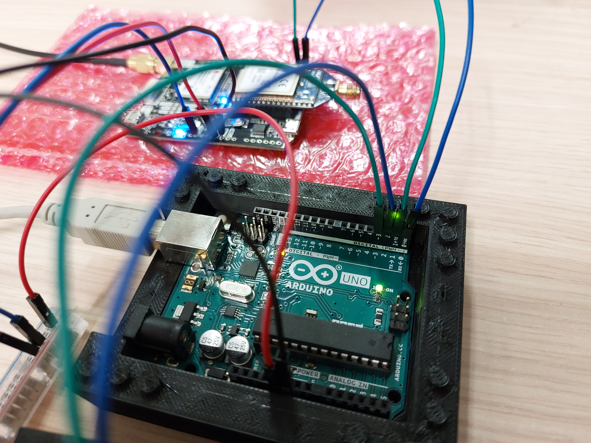

# UnoSat RTK Example - RTK Sensor

This project part of the RTK example and contains the code for a secondary Arduino Uno,
whose sole purpose is to interface with an
[Ardusimple simpleRTK2B module](https://www.ardusimple.com/product/simplertk2b),
extract location updates and forward them to the main Arduino.

The reason why this is not done directly on the main Arduino is because of the very limited
memory resources available on the Arduino Uno. The code in this project is deliberately made
very simple and small (no log message formatting for example), but the library used to parse
the location messages from the RTK module is very large, so this project as is uses more
than 96% of the Arduino Uno's available Flash memory.


## Requirements

### Hardware

* Arduino Uno
* Ardusimple simpleRTK2B module
* At least 5 jumper cables

### Software

[Python](https://www.python.org) needs to be installed on the system, at least version `3.7` is required.

This project uses the [ECom](https://gitlab.com/team-aster/software/ecom) library (version `1.1`)
to define how to communicate with the Arduino and for generating some code for it.
The library must be installed if any changes to the communication are necessary.

Because the code in this project is spread out over multiple files,
the Arduino IDE can not be used to compile and upload the project onto the Arduino.
Instead, this project uses [PlatformIO](https://docs.platformio.org),
which can be downloaded [here](https://docs.platformio.org/en/latest/core/installation/index.html).
Also install the PlatformIO shell commands by following the instructions
[here](https://docs.platformio.org/en/latest/core/installation/shell-commands.html).

[Clion](https://www.jetbrains.com/clion) with the
[Platform IO plugin](https://www.jetbrains.com/help/clion/platformio.html#install-plugin) can be used as an
alternative to the Arduino IDE, but any other IDE should work as well.

After the installation, run the following command in the [root directory of the project](.)
(where this README is located) to finish initialization of the project:

```shell
pio project init
```

## Hardware setup

In this setup, the system is connected to power via the Arduino Uno, either by USB or power jack connection.
One of the ground pins of the Arduino Uno has to be connected with one of the ground pins on the simpleRTK2B.
The 5V pin of the Arduino has to be connected to the `5V_IN` port of the simpleRTK2B,
as well as the `IOREF` pin, because the Arduino Uno uses 0 - 5 volts on it's IO ports.

The communication line with the RTK module needs to be connected to UART1 (pin 0 and pin 1),
the only hardware UART port on the Arduino Uno, because it is the only one that can operate at the required baud rate.
The RX pin (pin 0) on the Arduino is connected to the `TX1` pin on the simpleRTK2B.
The TX pin (pin 1) on the Arduino is connected to the `RX1` pin on the simpleRTK2B.

Pin 2 (RX) and 3 (TX) will be connected to the base Arduino.

| Arduino pins                                 | SimpleRTK2B pins                                 |
|----------------------------------------------|--------------------------------------------------|
|  |  |

## Building and Flashing

To build the project and upload it to an Arduino Uno, connect the Arduino to the computer.
Temporarily unplug the communication pins (pin 0 and 1) to the simpleRTK2B,
otherwise the upload will fail because the UART1 and USB connection share the same port.
Finally, execute the following command in the [root directory of the project](.):

```shell
pio run --target upload
```

This will upload the code onto the Arduino.
If multiple devices are connected to the computer, it might be necessary to specify
which serial port to upload to via the `--upload-port` argument.

### Change the communication definition

In order to change the communication, the communication database in the
[`communication` directory](communication) must be changed.
An explanation of the files and folders in that directory and how to edit them can be found in the
[ECom documentation](https://ecom.readthedocs.io/en/latest/database/README.html).
No special program is required, a simple text editor is enough. After the changes have been made,
the following command has to be executed in the [root directory of the project](.) to update the generated code:

```shell
ecomUpdate --database communication src include
```

The base Arduino has to be updated as well:

```shell
ecomUpdate --forBase --prefix rtk --database communication ../src ../include
```

## Troubleshooting

* `Error: Unknown command "pio"` or similar error:

  This means that PlatformIO is not installed, or not installed correctly,
  or that the PlatformIO shell commands are not installed correctly.
  Make sure that no step in the [software requirements section](#software) was skipped.

* `Error: Unknown command "ecomUpdate"` or similar error:

  This means that ECom library is not installed. If the ECom library was just downloaded,
  but not installed, then the full path to the `ecomUpdate.py` has to be specified when executing the command.

* The `pio run` command fails while trying to find an upload port, even though the Arduino is connected.

  Check that the cable to the Arduino is actually connected.
  Additionally, old Windows systems might not have the required drivers installed to communicate with the Arduino.
  In this case it is recommended to install the Arduino IDE, because that will also install all the necessary drivers.
