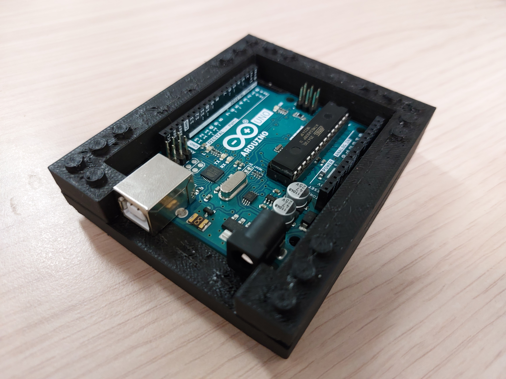

# UnoSat Project Template

This is a template for the software part of the UnoSat platform.
It can be used as a starting point to implement a project with the UnoSat platform.

The template is fully functional and can be uploaded to an Arduino Uno to test it out.
It will print a two log messages during boot and then send a package with the current time since boot every second.
The simple groundstation example from the ECom library can be used to see the messages on a connected computer.



## Requirements

### Hardware

* Arduino Uno

### Software

[Python](https://www.python.org) needs to be installed on the system, at least version `3.7` is required.

This project uses the [ECom](https://gitlab.com/team-aster/software/ecom) library (version `1.1`)
to define how to communicate with the Arduino and for generating some code for it.
The library must be installed if any changes to the communication are necessary. It also includes a
[simple groundstation](https://gitlab.com/team-aster/software/ecom/-/tree/main/examples/simpleGroundstation)
as an example, which can be used to read the telemetry from the Arduino.

Because the code in this project is spread out over multiple files,
the Arduino IDE can not be used to compile and upload the project onto the Arduino.
Instead, this project uses [PlatformIO](https://docs.platformio.org),
which can be downloaded [here](https://docs.platformio.org/en/latest/core/installation/index.html).
Also install the PlatformIO shell commands by following the instructions
[here](https://docs.platformio.org/en/latest/core/installation/shell-commands.html).

[Clion](https://www.jetbrains.com/clion) with the
[Platform IO plugin](https://www.jetbrains.com/help/clion/platformio.html#install-plugin) can be used as an
alternative to the Arduino IDE, but any other IDE should work as well.

After the installation, run the following command in the [root directory of the project](.)
(where this README is located) to finish initialization of the project:

```shell
pio project init
```

## Building and Flashing

To build the project and upload it to an Arduino Uno, connect the Arduino to the computer.
If some hardware is connected to the UART1 port of the Arduino, temporarily unplug it,
otherwise the upload will fail because the UART1 and USB connection share the same port.
Finally, execute the following command in the [root directory of the project](.):

```shell
pio run --target upload
```

This will upload the code onto the Arduino.
If multiple devices are connected to the computer, it might be necessary to specify
which serial port to upload to via the `--upload-port` argument.

## Editing the template

The template as it is provides a working starting point for a project with the UnoSat platform.
For an actual project one probably wants to connect some external hardware to the Arduino Uno
potentially read some data from it. There are three steps and locations to change this template:

1. **Add dependencies**

   When interfacing with a hardware, you will usually want to use a library for that hardware
   and the Arduino Uno. If the library exists as a PlatformIO package and can be found
   [here](https://registry.platformio.org), you can add the following line
   to the [`platformio.ini` file](platformio.ini):
   ```ini
   lib_deps = libraryName@^version
   ```
   More information about PlatformIO dependency management can be found
   [here](https://docs.platformio.org/en/latest/librarymanager/dependencies.html).

   If the library is not available as a PlatformIO package, it can be copied manually into the [`lib` directory](lib).

2. **Communicate with hardware and gather data**

   In the next step, code has to be written to initialize and communicate with the new hardware to gather data.
   It is recommended to put this code in a separate file in the [`src` directory](src) and the call the relevant parts
   from the [`main.cpp` file](src/main.cpp). From the `main.cpp`, you can edit the section in the `setup` function
   to call initialization functionality, and the `loop` function to call the data gathering functionality.

3. **Change the communication definition**

   When adding a new telemetry package or changing the data sent with an existing telemetry package,
   the communication database in the [`communication` folder](communication) has to be edited.
   An explanation of the files and folders in that directory and how to edit them can be found in the
   [ECom documentation](https://ecom.readthedocs.io/en/latest/database/README.html).
   No special program is required, a simple text editor is enough. After the changes have been made,
   the following command has to be executed in the [root directory of the project](.) to update the generated code:
   ```shell
   ecomUpdate --database communication src include
   ```
   Now the [`main.cpp` file](src/main.cpp) can be edited to call the new generated functions and pass the data
   gathered in step 2 to send to the base.

## Troubleshooting

* `Error: Unknown command "pio"` or similar error:

  This means that PlatformIO is not installed, or not installed correctly,
  or that the PlatformIO shell commands are not installed correctly.
  Make sure that no step in the [software requirements section](#software) was skipped.

* `Error: Unknown command "ecomUpdate"` or similar error:

  This means that ECom library is not installed. If the ECom library was just downloaded,
  but not installed, then the full path to the `ecomUpdate.py` has to be specified when executing the command.

* The `pio run` command fails while trying to find an upload port, even though the Arduino is connected.

  Check that the cable to the Arduino is actually connected.
  Additionally, old Windows systems might not have the required drivers installed to communicate with the Arduino.
  In this case it is recommended to install the Arduino IDE, because that will also install all the necessary drivers.
